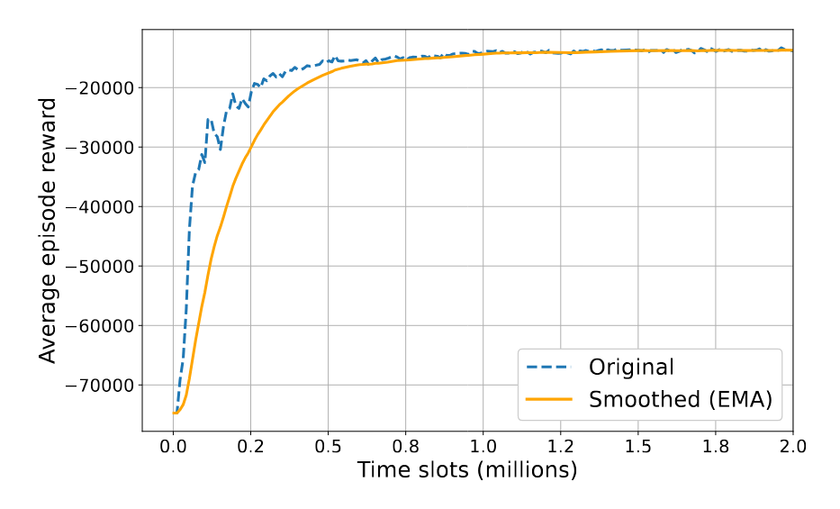

# Multi-Agent Reinforcement Learning for Multi-Cell Spectrum and Power Allocation

This repository contains the implementation of our work: Multi-Agent Reinforcement Learning (MARL) based spectrum and power allocation in multi-cell networks.

## Repository Structure

The repository is organized into five main folders:

1. `8device_conflict_graph_benchmarks`: Contains benchmark algorithms for the conflict graph scenario
2. `57device_celluar_network_benchmarks`: Contains benchmark algorithms for the cellular network scenario
3. `MARL_cellular`: Contains examples of MARL algorithms for the cellular network scenario, with two subfolders:
   - `cell19link57_dr20_hexa`: Network configuration with 19 cells serving 57 devices in a regular deployment (Fig. 6(a) in paper)
   - `cell19link57_dr20_random`: Network configuration with 19 cells serving 57 devices in a random deployment (Fig. 6(b) in paper)
   <p float="left">
    
   </p>
   

4. `MARL_conflict`: Contains example of MARL algorithms for the conflict scenario, with one subfolder:
   - `agent4device8_dr0.4`: The conflict graph of 4 agents in a symmetric deployment (Fig 2 in paper)

   

5. `reward_learning_curve`: Contains the example of plotting learning curve of Fig. 12, 13 in paper 
   
## Getting Started

The required packages can be found in requirement.txt file.

### MARL Training Examples

We provide two Multi-Agent Reinforcement Learning (MARL) training examples:
1. Conflict Graph Scenario
2. Cellular Network Scenario

#### Using Pre-trained Models
Pre-trained models are available in the `results` folder of each scenario, for example MARL_cellular/cell19link57_dr20_random/results.

#### Training from Scratch
To train the models from scratch:
1. Navigate to the corresponding experiment setting folder, for example MARL_cellular/cell19link57_dr20_random
2. Enter the `train` subfolder
3. Run: `python train.py`

Researchers can experiment with different network configurations by adjusting the number of AP, number of devices, number of channels, traffic load, and other network parameters.

### Evaluation

#### Model Evaluation
1. Navigate to the train subfolder
2. Run: `python eval.py` (Note that if you run training for several times, you need to specify the evaluation model with run# in eval.py, the default is to evaluate the model in run1)
3. After the evaluation finishes, according to the printed information, you can find the saved data npz file that stores information through evaluation including average delay, queue length, and other performance metrics.

#### Benchmark Comparisons
To compare with benchmark algorithms like FP, WMMSE:
1. Create the folder corresponding experiment setting folder and run `python benchmark.py`. You can set up different network configurations and different benchmark algorithms.
2. After evaluation, navigate to and rename the saved data, then move it to the benchmark folder. 
For example, if you are experimenting with agents with individual policies, 3 channels and 57 links with random deployment, you can name it as separate_ch3_57links_dr25_rdTrue.npz

#### Results Generation

To generate CDF results (Fig. 7 and Fig. 11 in paper):
1. Navigate to the corresponding directory (`8device_conflict_graph_benchmarks` or `57device_celluar_network_benchmarks`)
2. Run: `python generate_cdf.py`

To generate packet delay results (Fig. 8, Fig. 9, and Fig 10):
1. Navigate to the corresponding directory
2. Run: `python generate_cluster.py`

## Citation

If you find any part of this codebase useful in your research, please cite our paper:

```bibtex
@article{zhang2025multiagent,
  title={Multi-Agent Reinforcement Learning for Multi-Cell Spectrum and Power Allocation},
  author={Zhang, Yiming and Guo, Dongning},
  journal={IEEE Transactions on Communications},
  year={2025},
  publisher={IEEE},
  doi={10.1109/TCOMM.2025.3534565},
  issn={0090-6778}
}
```
## Additional Information
The workflow of our MARL framework is described in the following figure:

For detailed methodology and results interpretation, please refer to our paper. 

## License

This project is licensed under the MIT License - see the LICENSE file for details.

---
© 2024 Northwestern University. All rights reserved.
